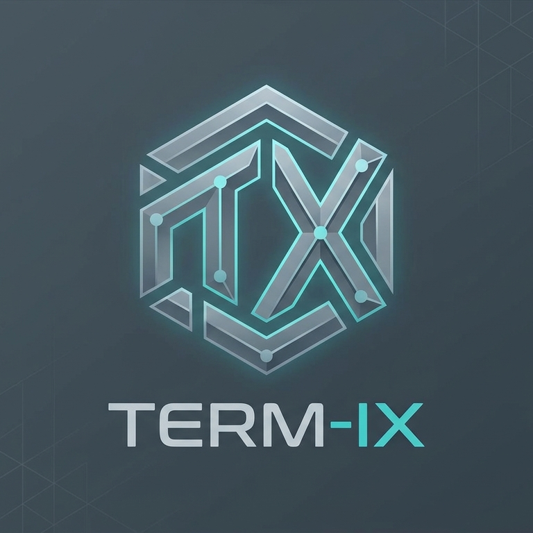

<p align="center">
  
</p>
<p align="center">
  <a href="https://www.paypal.com/paypalme/DaTTcz">
    
  </a>
  &nbsp;&nbsp;
  <a href="https://ko-fi.com/dattcz">
    
  </a>
</p>

# Term-IX

Desktopový terminálový klient pro správu vzdálených SSH spojení - napsaný v Rustu, pro Windows i Linux.

Vestavěný terminálový emulátor, strom uložených serverů se šifrovaným trezorem, info proužek se stavem serveru a rozdělené zobrazení dvou spojení vedle sebe.

---

## ✨ Funkce

- **Vestavěný SSH terminál** — VT100/ANSI emulace přímo v tabu aplikace, žádné externí okno konzole
- **Kopírování / vkládání** — označení textu tažením myši, zkopírování přes Ctrl+C, vložení přes Ctrl+V
- **Rozdělené zobrazení** — dva taby vedle sebe, přepínání fokusu klikem nebo Ctrl+Tab, pro práci na dvou spojeních najednou
- **Šifrovaný trezor serverů** — AES-256-GCM + Argon2id, hlavní heslo se zadává přímo v okně appky
- **Strom serverů** — složky (i vnořené), hledání, přejmenování, přesouvání, export/import trezoru
- **Info proužek pod terminálem** — vytížení CPU, RAM, síť nahoru/dolů, místo na disku, uptime, přihlášení uživatelé a skutečný hostname serveru
- **Automatické obnovení spojení** po výpadku (volitelné), barevně odlišený "mrtvý" tab
- **Dvě témata** — tmavé (Terminálové) a světlé (Moderní)
- **Čeština i angličtina**, přepínatelné v nastavení
- **Hostovský režim** — rychlé připojení bez hlavního hesla, nic se neukládá na disk
- **Automatická kontrola aktualizací** — appka si sama zkontroluje novou verzi na GitHubu

## 📋 Požadavky

- Windows nebo Linux
- Ke stažení jako hotová binárka (viz níže) — žádné další závislosti k instalaci nejsou potřeba
- Pro sestavení ze zdrojáků: [Rust](https://rustup.rs) (stable)

## 🚀 Instalace

Nejjednodušší cesta — stáhni hotovou binárku z [Releases](https://github.com/DaTTcz/Term-IX/releases) pro svůj systém (Windows `.zip` / Linux `.tar.gz`), rozbal a spusť.

Sestavení ze zdrojáků:

```sh
git clone https://github.com/DaTTcz/Term-IX.git
cd Term-IX
cargo build --release
# výsledná binárka: target/release/term-ix(.exe)
```

Při prvním spuštění appka vyzve k nastavení hlavního hesla trezoru (nebo k pokračování bez hesla v hostovském režimu).

Přepínače: `--no-splash` přeskočí úvodní okno s logem, `--no-update` přeskočí kontrolu aktualizací.

> **Windows:** appka zatím není podepsaná certifikátem, takže Windows SmartScreen může při prvním spuštění ukázat upozornění na neznámého tvůrce. Stačí kliknout na „Další informace“ → „Přesto spustit“.

## 🔄 Aktualizace

Appka si sama hlídá nové verze na GitHubu a při startu nabídne stažení a výměnu běžící binárky. Release proces (`.github/workflows/release.yml`) po vytvoření tagu `vX.Y.Z` automaticky zabuildí a nahraje binárky pro Windows i Linux.

## 🔒 Bezpečnost uložených serverů

- Uložené servery (host, port, uživatel, heslo, ...) jsou vždy **zašifrované na disku**: AES-256-GCM, klíč odvozený z hlavního hesla přes Argon2id.
- Kdo hlavní heslo zapomene, k uloženým údajům se už nedostane — žádný reset ani "zadní vrátka" v appce záměrně nejsou.
- **Známé omezení:** SSH modul zatím neověřuje otisk klíče serveru (žádný `known_hosts`, TOFU-accept-all) — připojí se k čemukoli, co odpoví. Doplnit před použitím na sítích, kde hrozí MITM.

## 🏗️ Architektura

Aplikace je rozdělená do samostatných cargo crates (workspace), aby šlo přidávat protokoly bez zásahu do zbytku appky.
Přidání nového protokolu (např. sériová linka / FTP): nový crate implementující `termx_core::ProtocolModule`, zaregistrovat v `src/main.rs`, rozšířit `termx_core::Protocol` — zbytek appky (GUI, vault, update) se tím nemusí měnit.

## 🛠️ Technologie

- **Jazyk:** Rust
- **GUI:** [egui](https://github.com/emilk/egui) / eframe
- **Terminálový emulátor:** [alacritty_terminal](https://github.com/alacritty/alacritty) (VT100/ANSI parser)
- **Šifrování trezoru:** AES-256-GCM + Argon2id
- **SSH:** [russh](https://github.com/Eugeny/russh)

## ⚠️ Prohlášení

Term-IX je stále rané, aktivně vyvíjené softwarové dílo. Používáš na vlastní riziko — appka se přímo přihlašuje na tvoje servery a posílá jim příkazy. Doporučujeme vyzkoušet.

## 📄 Licence

[PolyForm Noncommercial 1.0.0](LICENSE) — appku smíš volně používat, upravovat a sdílet pro nekomerční účely (osobní, vzdělávací, hobby). **Komerční využití vyžaduje svolení autora** — ozvi se přes GitHub, domluvíme se.

## 🙏 Poděkování

- [egui](https://github.com/emilk/egui) a [alacritty](https://github.com/alacritty/alacritty) za skvělé open-source knihovny, na kterých Term-IX staví
